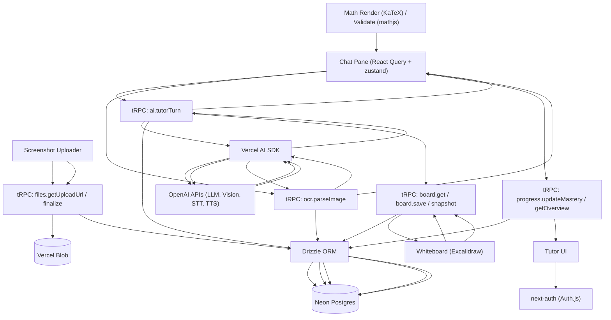

```mermaid
flowchart TD
UI["Tutor UI"]
Chat["Chat Pane (React Query + zustand)"]
Board["Whiteboard (Excalidraw)"]
Math["Math Render (KaTeX) / Validate (mathjs)"]
Upload["Screenshot Uploader"]

AIr["tRPC: ai.tutorTurn"]
OCRr["tRPC: ocr.parseImage"]
BR["tRPC: board.get / board.save / snapshot"]
PR["tRPC: progress.updateMastery / getOverview"]
FR["tRPC: files.getUploadUrl / finalize"]

Auth["next-auth (Auth.js)"]
SDK["Vercel AI SDK"]
DBClient["Drizzle ORM"]
PG[("Neon Postgres")]
VB[("Vercel Blob")]
OAI["OpenAI APIs (LLM, Vision, STT, TTS)"]

%% Auth
UI --> Auth

%% Chat / Tutor Turn
Chat --> AIr
AIr --> SDK
SDK --> OAI
OAI --> SDK
SDK --> AIr
AIr --> DBClient
DBClient --> PG
AIr --> Chat

%% Upload / OCR
Upload --> FR
FR --> VB
Upload --> FR
FR --> DBClient
DBClient --> PG
Chat --> OCRr
OCRr --> SDK
SDK --> OAI
OAI --> SDK
SDK --> OCRr
OCRr --> DBClient
DBClient --> PG
OCRr --> Chat

%% Whiteboard
Board --> BR
BR --> DBClient
DBClient --> PG
Board --> BR
AIr --> BR
BR --> Board

%% Progress
Math --> Chat
Chat --> PR
PR --> DBClient
DBClient --> PG
PR --> UI
```
