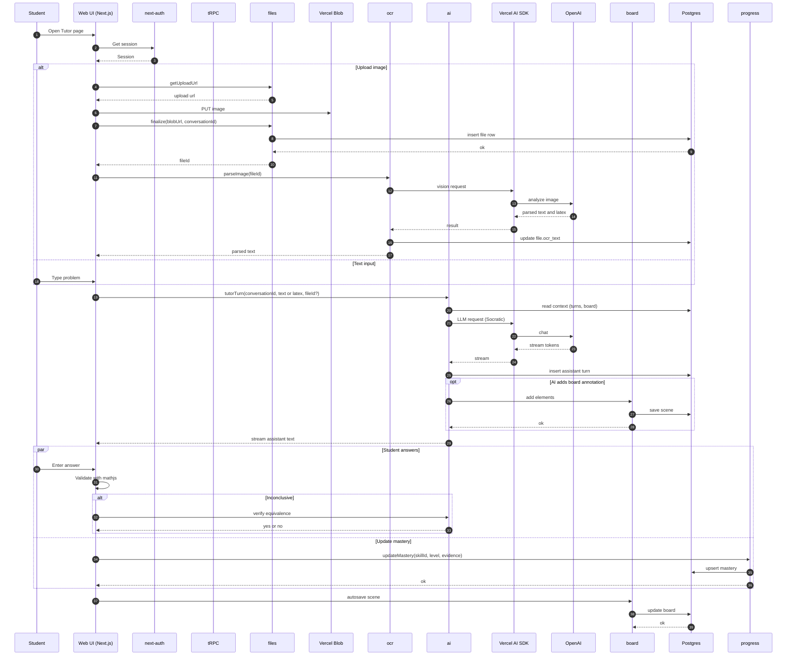

```mermaid
sequenceDiagram
autonumber

participant S as Student
participant C as Web UI (Next.js)
participant AUTH as next-auth
participant T as tRPC
participant FILES as files
participant BLOB as Vercel Blob
participant OCR as ocr
participant AI as ai
participant SDK as Vercel AI SDK
participant OAI as OpenAI
participant BOARD as board
participant DB as Postgres
participant PROG as progress

%% Launch and auth
S->>C: Open Tutor page
C->>AUTH: Get session
AUTH-->>C: Session

%% Intake
alt Upload image
C->>FILES: getUploadUrl
FILES-->>C: upload url
C->>BLOB: PUT image
C->>FILES: finalize(blobUrl, conversationId)
FILES->>DB: insert file row
DB-->>FILES: ok
FILES-->>C: fileId
C->>OCR: parseImage(fileId)
OCR->>SDK: vision request
SDK->>OAI: analyze image
OAI-->>SDK: parsed text and latex
SDK-->>OCR: result
OCR->>DB: update file.ocr_text
OCR-->>C: parsed text
else Text input
S->>C: Type problem
end

%% Tutor turn
C->>AI: tutorTurn(conversationId, text or latex, fileId?)
AI->>DB: read context (turns, board)
AI->>SDK: LLM request (Socratic)
SDK->>OAI: chat
OAI-->>SDK: stream tokens
SDK-->>AI: stream
AI->>DB: insert assistant turn

opt AI adds board annotation
AI->>BOARD: add elements
BOARD->>DB: save scene
BOARD-->>AI: ok
end

AI-->>C: stream assistant text

%% Student response and progress
par Student answers
S->>C: Enter answer
C->>C: Validate with mathjs
alt Inconclusive
C->>AI: verify equivalence
AI-->>C: yes or no
end
and Update mastery
C->>PROG: updateMastery(skillId, level, evidence)
PROG->>DB: upsert mastery
PROG-->>C: ok
end

%% Board autosave
C->>BOARD: autosave scene
BOARD->>DB: update board
DB-->>BOARD: ok
```
